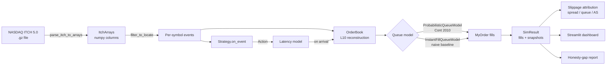

# obscura

**Pure-Python order-book replay + queue-position-aware backtester.**

[](https://github.com/SpacerexSoul/obscura/actions/workflows/ci.yml)
[](LICENSE)
[](https://www.python.org/downloads/)
[]()

> Vectorised backtesters silently lie about HFT profitability because they assume your order fills the moment price touches your level. `obscura` is the open-source generalisation of the lessons most people have to learn the hard way.

## What this is

A pure-Python pipeline that:

1. Parses raw **NASDAQ ITCH 5.0** binary files (every order arrival, modification, cancel, execute on NASDAQ at nanosecond precision).
2. Reconstructs the full L10+ order book.
3. Simulates a **passive limit-order strategy** with realistic queue-position dynamics (Cont 2010 intra-level approximation) and configurable network/matching latency.
4. Attributes slippage into three additive components: **spread**, **queue-loss**, **adverse-selection**.
5. Produces an **honesty-gap report**: same strategy, same data, two queue models — one naive (any trade at the level fills you), one queue-aware. The gap is the cost most backtests hide.

What it isn't: a live trading platform, an alpha library, or another notebook of mean-reversion claims.

## Why

Most Python backtesters either skip microstructure entirely (signals on bars, ideal fills) or are Rust-cored and crypto-only. There's a missing tier: a Python-native, equity-microstructure, queue-aware backtester with a screencastable web frontend. That's what `obscura` is.

## Quickstart

```bash
git clone https://github.com/SpacerexSoul/obscura
cd obscura
python -m venv .venv && source .venv/bin/activate
pip install -e ".[dev,dashboard]"
```

```bash
# Download one day of real NASDAQ ITCH (free, no auth).
obscura download --date 12302019 --out data/itch
# ~3.5 GB compressed; takes ~10 min on a typical home connection.

# Reconstruct AAPL's top-of-book at the end of the first 5M events.
obscura book data/itch/12302019.NASDAQ_ITCH50.gz --symbol AAPL --limit 5000000

# Honesty-gap report: PennyMM under naive vs queue-aware fills.
obscura analyze honesty-gap data/itch/12302019.NASDAQ_ITCH50.gz \
    --symbol AAPL --strategy PennyMM --limit 200000 --out report.md

# Live Streamlit dashboard.
streamlit run src/obscura/dashboard/app.py
```

## The honesty gap (the demo)

Run `obscura analyze honesty-gap` on a real NASDAQ ITCH slice — `PennyMM`,
AAPL, 400k events:

```
Symbol: AAPL · Strategy: PennyMM · Final mid: $290.2300

| Metric                    | Naive (instant fill) | Queue-aware (Cont 2010) | Gap         |
|---                        |                  ---:|                     ---:|         ---:|
| Realised cash ($)         |           +29,012.00 |                   +0.00 |  +29,012.00 |
| Marked P&L ($)            |               -11.00 |                   +0.00 |      -11.00 |
| Fills                     |                    1 |                       0 |          +1 |
| Shares filled             |                  100 |                       0 |        +100 |
| Inventory at end (shares) |                 -100 |                      +0 |           — |
```

Read it: the naive backtester rewards itself with **+$29k of cash** for
"catching the spread" on one fill. But it's left short 100 AAPL — and once
that inventory is marked at the closing mid, the **honest P&L is -$11**.
The queue-aware model says the strategy never won queue priority and
therefore captured **nothing**. Both arrive at "this strategy made roughly
nothing" — but the naive number on its own would have looked tradeable.

> Same strategy. Same event stream. Two queue models. The gap is queue priority you weren't paying for.

## Architecture



## Repository layout

```
src/obscura/
├── book/                   # ITCH parser + L2 reconstruction
│   ├── itch_parser.py      # iterate-y reference parser (BookEvent generator)
│   ├── array_parser.py     # numpy-column parser (~2x faster)
│   ├── book.py             # OrderBook + Hypothesis invariants
│   ├── array_book.py       # batch apply for the array path
│   └── types.py            # MessageType, Side, BookEvent
├── sim/                    # Event-driven simulator
│   ├── exchange.py         # run() loop wiring book + queue + strategy
│   ├── queue.py            # ProbabilisticQueueModel + InstantFillQueueModel
│   ├── latency.py          # configurable network + matching delay
│   └── types.py            # Action, MyOrder, Fill, SimResult, Snapshot
├── strategies/             # Three baseline strategies
│   ├── penny_mm.py         # joins-best in tight spread, pennies inside in wide
│   ├── obi.py              # order-book imbalance directional
│   └── mean_rev.py         # streaming Welford z-score mean reversion
├── analysis/
│   ├── slippage.py         # 3-component additive attribution
│   └── honesty_gap.py      # naive vs queue-aware comparison
├── dashboard/app.py        # Streamlit live replay
└── cli.py                  # download / parse / book / analyze honesty-gap
```

## Status

Pre-alpha. 60+ tests, 90% line coverage, ruff-clean. Pinned property tests on book invariants and on the queue-decay model. CI on GitHub Actions across Python 3.11 and 3.12.

Roadmap: multi-symbol replay, walk-forward + purged-CV harness, ML leakage detector, more strategies.

## References

- Cont, R., Stoikov, S., & Talreja, R. (2010). [*A stochastic model for order book dynamics*](https://www.maths.lse.ac.uk/Personal/luitgard/RC_OperationsResearch.pdf). *Operations Research*, **58**(3), 549-563.
- NASDAQ. [*TotalView-ITCH 5.0 Specification*](https://www.nasdaqtrader.com/content/technicalsupport/specifications/dataproducts/NQTVITCHspecification.pdf).
- NASDAQ EMI public ITCH directory: [emi.nasdaq.com/ITCH/Nasdaq ITCH/](https://emi.nasdaq.com/ITCH/Nasdaq%20ITCH/).
- Welford, B. P. (1962). *Note on a method for calculating corrected sums of squares and products.* *Technometrics*, **4**, 419-420.

## License

MIT.
